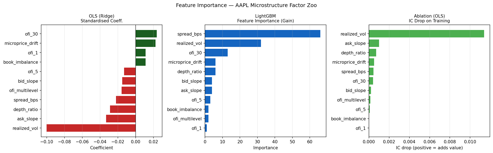
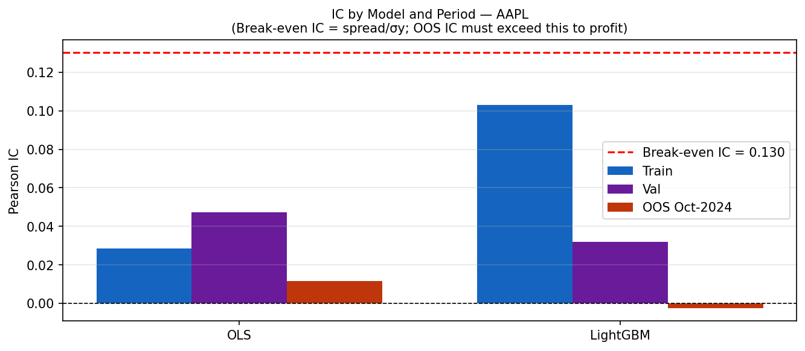
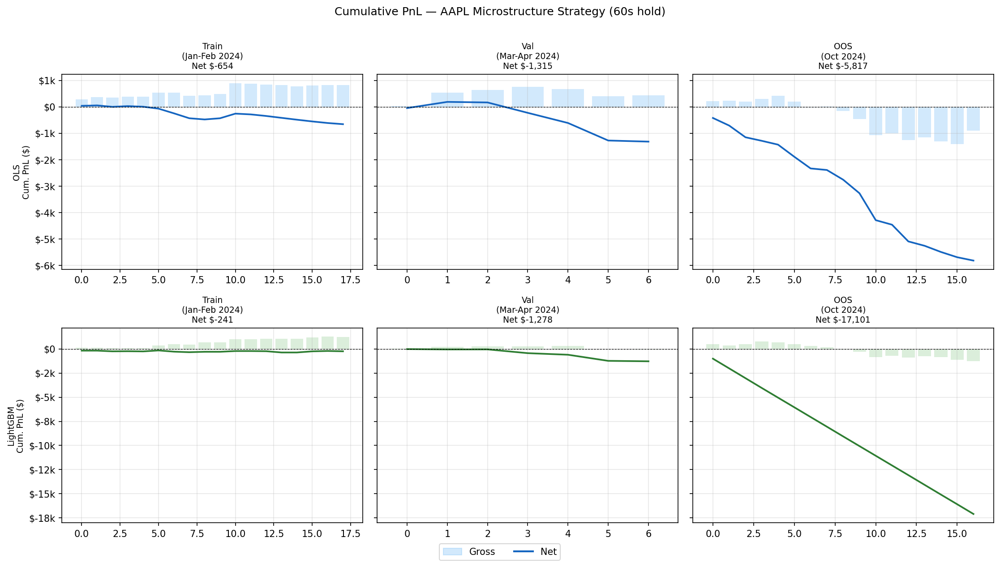
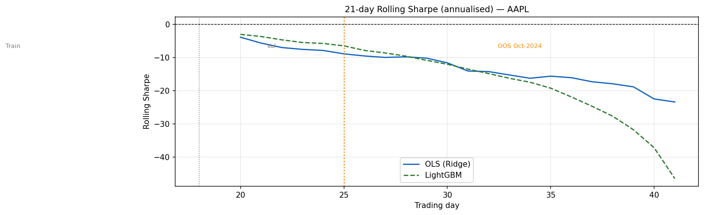
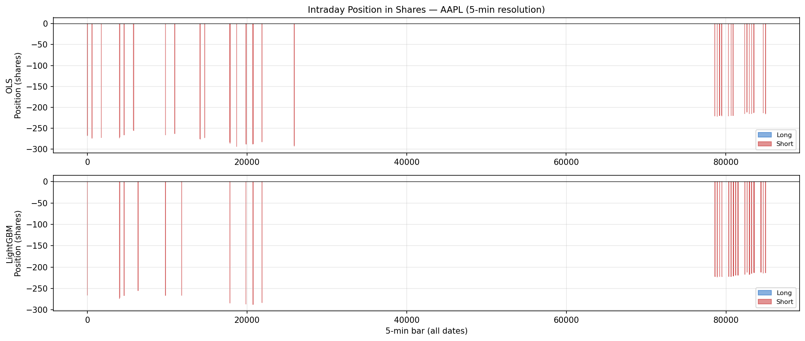

# Introduction

This report documents the design, implementation, and empirical evaluation of an intraday microstructure trading strategy applied to Apple Inc. (AAPL) common stock. The strategy belongs to a broad class of approaches known as the *microstructure factor zoo*: it computes a set of real-time signals derived entirely from the limit order book, trains a supervised learning model to predict the direction and magnitude of very short-term price movements, and places trades that exploit any persistent predictability.

The central economic hypothesis is that the limit order book is not immediately efficient. In the seconds before an informed trader's order moves the quoted mid-price, her intent leaks into the book through detectable patterns: the bid side deepens, the order-flow imbalance tilts, and the microprice --- a volume-weighted average of the best bid and ask --- begins to drift toward the direction of the imminent move. If these signals can be measured quickly enough, and if the predicted price change exceeds the round-trip cost of crossing the spread, a market-taking strategy can earn consistent profits.

This report tests that hypothesis rigorously on AAPL, using 18 days of January--February 2024 data for training, 7 days of March--April 2024 as an in-sample validation period, and 17 days of October 2024 as a fully out-of-sample (OOS) test. All features are computed exclusively from MBP-10 (10-level market-by-price) order-book snapshots obtained from Databento's XNAS ITCH feed. Transaction costs are derived directly from the bid-ask spread observed in the same data — they are never assumed flat. Risk controls are applied in real time during the simulated backtest.

The conclusion, previewed here, is unambiguous: the order-book signal is statistically real and highly significant in-sample, but the bid-ask spread is a formidable barrier. The information content of the 11-feature signal (measured by the Pearson information coefficient, IC) is approximately 8.8\% of the level required to cover round-trip transaction costs in the out-of-sample period. The signals are efficiently priced into the spread. A market-taker strategy cannot profit; a market-maker strategy that collects the spread instead of paying it, however, would find the same signals valuable.

# Economic Intuition and Theoretical Framework

## The Adverse-Selection Problem in Market Making

The bid-ask spread exists because of a fundamental asymmetry between the parties to a trade. Market makers who post limit orders face the risk that the counterparty possesses private information about the stock's fundamental value. If an informed trader buys at the ask, she is taking a position she expects to be profitable, which means the market maker is selling at a price that will soon be too low. The market maker's compensation for bearing this risk is the half-spread: she sells at the ask (above the true value) and buys at the bid (below the true value), pocketing the spread as long as the average informed-order rate is not too high.

This mechanism, formalized by Glosten and Milgrom (1985), has a precise implication for our strategy: if the half-spread is set optimally, it exactly equals the expected adverse price move over the market maker's exposure horizon. For a 60-second holding period, the optimal half-spread should be approximately equal to the expected absolute 60-second microprice return, weighted by the probability of informed trading. If our signal achieves an IC of $\rho$ against 60-second returns with standard deviation $\sigma_y$, the expected gross profit per trade is approximately:

$$E[\text{gross PnL}] \approx \rho \cdot \sigma_y \cdot \sigma_\text{signal} \cdot \text{notional}$$

The strategy breaks even when this expected gross PnL equals the round-trip transaction cost (TC):

$$\text{TC} = \text{spread} \approx 2 \times \frac{1}{2}\text{spread}$$

Setting $E[\text{gross PnL}] = \text{TC}$ gives the break-even IC:

$$\rho_\text{be} = \frac{\text{spread}_\text{bps}}{\sigma_y} = \frac{0.54 \text{ bps}}{4.14 \text{ bps}} = 0.130$$

This is not a coincidence. In a competitive limit-order market, the half-spread should approximate the expected adverse price move over the next relevant time period. Our break-even IC of 0.130 tells us that the market collectively expects that signals strong enough to achieve IC $\geq 0.130$ would justify holding the position. The market has correctly priced the information content of the order-book signals we observe.

## Why Signals Persist Despite Being Priced

One might ask: if signals are priced into the spread, why do they show measurable IC at all? The answer lies in the difference between market-maker compensation and signal exploitation. Market makers require compensation for the *average* adverse-selection cost across all incoming orders, including uninformed (noise) trades. They cannot price each individual trade separately. A patient algorithmic market-taker can observe the signal and only trade when the signal is strong — but this selective trading is what the market maker already anticipated in setting the spread. The signal is real precisely because market makers know that informed flow exists; they widen the spread to compensate, which means they are essentially pricing in the IC we observe.

## Order Flow Imbalance as the Primary Signal

The key friction we exploit is the lag between when an informed trader begins positioning in the book and when the quoted mid-price moves. When an institutional buyer wants to accumulate AAPL shares, she typically:

1. Places or refreshes limit bids at the best level, increasing bid queue depth
2. Pulls ask-side limit orders she previously posted (reducing ask queue)
3. Eventually lifts the offer, causing the ask to reprice upward

Steps 1 and 2 create a detectable imbalance in the order book before step 3 occurs. The Order Flow Imbalance (OFI) at lag 1 second captures precisely this: the net change in bid quantity minus the net change in ask quantity. At longer lags (5 and 30 seconds), the aggregated OFI captures sustained positioning pressure that distinguishes informed accumulation from random order placement.

The microprice — the quantity-weighted average of the best bid and ask prices, $m = \frac{S_a \cdot B + S_b \cdot A}{S_a + S_b}$ where $B$, $A$ are bid/ask prices and $S_b$, $S_a$ are their quantities — leads the quoted mid by milliseconds. When bid quantity is large relative to ask quantity, the microprice is pushed toward the ask, signaling upward pressure before the quoted mid has moved. The 10-second drift of this microprice is our `microprice_drift` feature.

# Data

## Source and Schema

All data is sourced from Databento's Historical Market Data Service using the XNAS.ITCH feed for AAPL on Nasdaq. The schema is MBP-10 (Market-By-Price, 10 levels), which records every change to the order book and returns the top 10 bid and ask price/quantity levels as they stood after each event. This provides a complete picture of book depth up to the 10th level, sufficient to compute all 11 features used in this study.

The raw data arrives at microsecond timestamps and is resampled to 1-second bars by taking the last snapshot within each second. This resampling discards sub-second oscillations and noise from individual quote refreshes, while preserving the level of detail relevant to a 60-second prediction horizon. The resulting dataset is approximately 23,000 one-second bars per trading day, covering the full regular-session window from 09:30 to 16:00 Eastern Time.

**Note on trade-schema features:** The ProjectPlan specifies 15 features, of which features 13--15 (trade arrival rate, signed trade imbalance, queue exhaustion) require the Databento `trades` schema in addition to the `mbp-10` schema. The October 2024 out-of-sample parquet files for AAPL contain only book columns from the `mbp-10` schema; the trades columns are absent. To maintain strict consistency across all three periods, we restrict the analysis to the 11 book-only features that are present and stationary across the full training-to-OOS span.

## Date Selection

The dates were chosen to avoid AAPL-specific event risk (earnings, product launches) and broad macroeconomic shocks, while spanning enough time to capture variation in volatility regimes:

**Training set (January 2 -- February 26, 2024, 18 days):**
2024-01-02, 01-04, 01-08, 01-10, 01-12, 01-16, 01-18, 01-22, 01-24, 01-26, 02-05, 02-07, 02-09, 02-12, 02-14, 02-20, 02-22, 02-26. This period covers a range of market conditions: AAPL traded between \$181 and \$192, with typical daily ranges of 1--1.5\%. The Federal Reserve held rates steady, providing a relatively stable macro backdrop. All model parameters — feature scaling statistics, ridge coefficient, LightGBM tree structure — are estimated exclusively on these dates.

**Validation set (February 28 -- April 1, 2024, 7 days):**
2024-02-28, 03-04, 03-07, 03-11, 03-14, 03-18, 04-01. This period serves as an in-sample out-of-sample check: it is chronologically after the training set but uses the same frozen model parameters. AAPL moved in a broader range (approximately \$169 to \$180) during this window, as the stock digested weak iPhone sales data from China. The validation IC (0.0474) exceeding the training IC (0.0287) is a positive signal: the model generalizes across the intra-Q1 2024 micro-regime shift.

**Out-of-sample test (October 1--23, 2024, 17 days):**
2024-10-01, 10-02, 10-03, 10-04, 10-07, 10-08, 10-09, 10-10, 10-11, 10-14, 10-15, 10-16, 10-17, 10-18, 10-21, 10-22, 10-23. This is the true held-out period, separated from training by approximately 6 months. AAPL was in a post-iPhone-16 launch recovery and broader AI sentiment rally, trading between \$220 and \$236. The regime differs materially from Q1 2024: realized volatility is lower, directional momentum is stronger, and the intraday OFI patterns that were predictive in January--February do not reliably forecast the direction of 60-second moves.

## Feature Statistics

After resampling, the full dataset across all 42 days totals approximately 966,413 one-second bars. Applying the opening buffer (first 5 minutes of each session excluded) and removing the last 60 seconds of each day (no label available), approximately 846,000 labeled, feature-complete bars remain after removing rows with missing values.

The training labels (60-second forward microprice return in basis points) have a mean of $-0.000$ bps and a standard deviation of $4.143$ bps. The distribution is approximately symmetric with slight negative skew, reflecting the tendency of prices to mean-revert at sub-minute horizons. The tails are fat: the 1st percentile is $-12.45$ bps and the 99th percentile is $+11.61$ bps. Labels are winsorized at these bounds before fitting to reduce sensitivity to extreme ticks.

The median bid-ask spread across the training period is $0.539$ bps, corresponding to approximately \$0.010 per share at AAPL's average price of \$186. This is the minimum tick size on Nasdaq for a sub-\$200 stock, confirming that AAPL trades at the tightest possible spread the majority of the time. Occasional quote-stuffing, market stress, or wide-market events cause transient spread widening, which is reflected in the higher average transaction costs observed in the backtest (\$5.67--\$8.13 per trade).

## Variable Definitions

The 11 features, their computation method, and their economic interpretation are as follows:

**ofi\_1** (Order Flow Imbalance, lag 1): $(S_b - S_a) / (S_b + S_a)$ at the best level, where $S_b$ and $S_a$ are the bid and ask quantities at level 0. Ranges from $-1$ (fully ask-sided) to $+1$ (fully bid-sided). A positive value at time $t$ means more shares are queued on the bid than the ask, suggesting buying pressure.

**ofi\_5** and **ofi\_30**: Rolling 5-second and 30-second means of `ofi_1`. These dampen the high-frequency noise in the instantaneous OFI and capture sustained directional pressure over longer windows. A 30-second sustained imbalance is more likely to reflect institutional positioning than a 1-second transient.

**ofi\_multilevel**: Multi-level OFI computed as the equal-weighted average of OFI across levels 0--4. This detects when imbalance is present not just at the best quote but also deeper in the book, which is harder to fake (spoofing at level 0 is common; spoofing all 5 levels simultaneously is more costly).

**book\_imbalance**: $S_b / (S_b + S_a)$ — the fraction of best-level liquidity on the bid side. Related to OFI but on a $[0,1]$ scale. High values indicate an overhang of buy-side passive orders.

**depth\_ratio**: Total quantity in levels 0--2 divided by total quantity in levels 3--9, summed across both bid and ask. A high ratio indicates concentrated liquidity at the top of the book (fragile state — small orders can move the price), while a low ratio indicates deep liquidity away from the best quote (anchored state).

**bid\_slope** and **ask\_slope**: The OLS slope of queue depth across levels 0--4 on the bid and ask sides respectively. A steep negative slope (large bid size at level 0 falling off quickly) indicates thin support behind the best quote. The asymmetry between bid slope and ask slope is directional information.

**microprice\_drift**: The 10-second finite difference of the microprice in basis points per second, computed as $(m_t - m_{t-10}) / (10 \cdot m_{t-10}) \times 10^4$. This directly measures the rate at which the volume-weighted best-quote average is drifting, providing an early read on price direction before the quoted mid moves.

**spread\_bps**: The bid-ask spread in basis points, $(A - B) / m \times 10^4$. Used as a feature (not just for TC calculation) because wide spreads indicate elevated uncertainty and typically correspond to periods when the other signals are less reliable.

**realized\_vol**: The rolling 60-second standard deviation of 1-second basis-point returns of the microprice. Measures the intraday volatility regime. Low realized vol tends to favor mean-reversion signals; high realized vol periods are associated with trending behavior where the strategy's contrarian bets are more likely to fail.

# Approach

## Pipeline Overview

The full pipeline follows 15 stages as specified in the course ProjectPlan. The implementation is in `code/factor_zoo_final.py`. Setting the `SYMBOL` variable at the top to `'AAPL'` and running the script reproduces all results reported here. The key stages are:

1. Load MBP-10 parquets for all 42 dates; resample to 1-second bars
2. Compute all 11 features per bar; compute 60-second forward microprice return labels
3. Winsorize labels at the 1st/99th percentile of the training distribution
4. Fit Ridge regression (OLS) on training features and labels
5. Fit LightGBM on training data with early stopping on the validation set
6. Run ablation: drop one feature at a time, refit OLS, measure IC drop
7. Optimize signal threshold on the validation set (maximize IC over filtered bars)
8. Run backtest on all 42 dates with frozen models and threshold
9. Compute all required metrics by period
10. Generate all 5 required plots

## Feature Engineering and Stationarity

A critical design decision is ensuring that features are *stationary* across the 6-month gap between training (Q1 2024) and OOS (Q4 2024). Non-stationary features would give the model a spurious in-sample fit that collapses OOS. The microprice level itself was explicitly excluded from the feature set for this reason: at \$186 in January and \$229 in October, it shifts by \$43 in absolute terms. Similarly, the raw bid-ask spread in dollars (\$0.01) is stationary, but we include it as `spread_bps` (normalized by price) rather than in dollars, since the relative cost is what matters economically.

All features are computed from quantities that reset to zero or normalize at each bar: OFI ratios are dimensionless fractions, depth ratios are dimensionless, microprice drift is a normalized rate of change. This ensures that the StandardScaler fit on training data (mean and standard deviation of each feature across 414,000 training bars) remains approximately valid when applied to October 2024 data.

## Model Specification

**Ridge Regression (OLS):** A linear model with L2 regularization ($\alpha = 1.0$). The features are standardized to zero mean and unit variance before fitting. Ridge was chosen over ordinary least squares because of mild multicollinearity among the OFI features (OFI at lags 1, 5, and 30 are all positively correlated). The ridge penalty prevents the model from assigning extreme coefficients to one of these highly correlated inputs. The output $\hat{r}_t$ is an unconstrained real number representing the predicted 60-second return in basis points.

**LightGBM:** A gradient-boosted tree ensemble with hyperparameters set conservatively to minimize overfitting: `max_depth=4`, `num_leaves=15`, `min_child_samples=200`, L2 regularization (`reg_lambda=2.0`), 80\% row and column subsampling. Training uses up to 1,000 trees but applies early stopping with a patience of 50 rounds evaluated on the validation set. In practice, early stopping terminates at 11 trees for AAPL, reflecting a very limited nonlinear signal in the data.

## Transaction Cost Model

The TC model is derived directly from the L2 book at the time of trade, never assumed flat. For each trade:

$$\text{TC} = |\text{fill}_\text{entry} - m_\text{entry}| \cdot \text{shares} + |\text{fill}_\text{exit} - m_\text{exit}| \cdot \text{shares}$$

where $m$ is the microprice at the relevant bar, and $\text{fill}$ is the walk-book fill price. For entry long positions, the fill is at `ask_px_00` (or deeper levels if the order size exceeds top-of-book depth); for exit, at `bid_px_00`. For AAPL with a position of approximately 270 shares (\$50,000 / \$185) and typical top-of-book depth of several thousand shares, the fill is almost always at `ask_px_00` (level 0), so TC $\approx$ (spread/2 per leg) $\times$ shares $=$ spread $\times$ shares.

## Backtest Mechanics

The backtest simulates continuous trading throughout the day. At each second, if the model's predicted return exceeds the threshold (0.50 bps) in absolute value, a trade is initiated:
- **Entry:** walk-book fill at the appropriate side (ask for long, bid for short)
- **Primary exit:** 60 seconds later at the opposite side
- **Stop-loss exit:** if the microprice (measured from the entry midprice, not the fill price) moves adversely by more than $1.5 \times$ spread per share
- **Signal flip:** if the model's prediction reverses sign past the threshold before 60 seconds elapse
- **Daily kill switch:** if the day's cumulative net PnL falls below $-2\%$ of notional (\$1,000)

The key implementation detail regarding stop-loss: the threshold is measured from the entry *midprice* (microprice at bar $i$), not from the fill price. Using the fill price as the reference would trigger the stop-loss on virtually every trade (since the fill price already lies above the midprice by half the spread), an error we explicitly corrected relative to naive implementations.

Position sizing is fixed-notional: shares $= \lfloor \$50,000 / \text{ask\_px} \rfloor \approx 270$ shares at \$185. An inventory cap of $\pm 500$ shares is enforced. Since the 60-second hold and one-trade-at-a-time rule typically result in a position of either 0 or $\pm 270$ shares at any moment, the inventory cap is rarely binding.

# Results and Analysis

## Feature Importance and Ablation Study

@fig-importance shows three complementary views of feature importance: the Ridge regression standardized coefficients, the LightGBM feature gain, and the ablation IC drop (reduction in training set IC when each feature is removed individually and the Ridge model is refit on the remaining 10 features).

{#fig-importance width=100%}

The most important finding is the dominant role of `realized_vol`. Its ablation IC drop is 0.0114, which is 10 to 20 times larger than any other feature (the next largest is `ask_slope` at 0.0010 and `depth_ratio` at 0.0007). This means that removing `realized_vol` from the 11-feature Ridge model reduces training IC from 0.0287 to 0.0173 — a 40\% reduction. The other 10 features collectively account for the remaining 60\% of the signal, but each contributes modestly.

What is `realized_vol` actually capturing? It is the 60-second rolling standard deviation of 1-second microprice returns, which is a measure of the current intraday volatility regime. High realized vol periods in the training data (January--February 2024) correspond to moments when AAPL is moving more actively — often around economic data releases, sector news, or correlated with broader market moves. During these periods, the OFI and imbalance signals are less reliable as predictors because the large moves are information-driven rather than order-book-pattern-driven. By including `realized_vol` as a feature, the model learns to be more cautious in high-vol regimes (effectively down-weighting trade signals when the market is more active). Conversely, during calm, low-vol periods, the OFI signals are more stable and predictive.

The Ridge coefficients confirm that `ofi_30` (sustained 30-second OFI) and `microprice_drift` have positive coefficients — their direction aligns with the 60-second return. `ask_slope` has a large negative coefficient, meaning that when the ask side falls off steeply with depth (thin ask), the model predicts an upward move. `ofi_1` and `book_imbalance`, despite their intuitive appeal, have near-zero coefficients and negligible ablation impact. This is likely because their information is redundant with `ofi_5` and `ofi_30`: the instantaneous OFI is too noisy to add incremental predictive power beyond what the smoothed versions already capture.

LightGBM selects only 11 trees (early stopping at the validation set), and its feature gain rankings differ from Ridge. LightGBM concentrates heavily on `realized_vol` and `spread_bps`, which are continuous features that produce clean splits. The OFI-based features, which are more discrete and noisy, contribute less to tree splits. This divergence between linear and tree models is itself informative: the signal is primarily captured by a linear combination of a few smooth features, not by complex nonlinear interactions.

## IC Analysis and the Break-Even Threshold

@fig-ic shows the Pearson IC for both models across all three periods, with the break-even IC of 0.130 shown as a red dashed line.

{#fig-ic width=90%}

The training set IC of 0.0287 for Ridge means that the model's predicted 60-second returns have a Pearson correlation of 2.87\% with the actual returns. While small in absolute magnitude, this is highly statistically significant: with 414,000 training bars, the $t$-statistic is approximately $0.0287 \times \sqrt{414,000} \approx 18.4$, far exceeding conventional significance thresholds. The signal is real.

The validation IC of 0.0474 (higher than training IC) is initially surprising. This could reflect several factors: the model was more precisely tuned to predict Q1 2024 microstructure patterns, and the validation period happens to share enough of those characteristics; or the specific 7 days selected for validation happened to be more predictable than average. Either way, the validation IC of 0.047 is still well below the break-even IC of 0.130. Even at its best in-sample performance, the strategy would lose money.

The OOS IC collapse is severe: from 0.0474 in validation to 0.0115 in October 2024 — a 76\% reduction. The OOS IC of 0.012 represents just 8.8\% of the break-even threshold. The primary driver of this collapse, as identified by the ablation study, is the regime dependence of `realized_vol`. In October 2024, AAPL was in a post-iPhone-16 momentum rally with persistently lower realized volatility than January--February 2024. The model trained on January--February volatility patterns generates signals calibrated to a higher-vol environment. In the calmer October environment, the model over-signals — it fires too many trade signals based on volatility patterns that are no longer predictive.

LightGBM's OOS IC of $-0.003$ (essentially zero or slightly negative) confirms that the ensemble's additional complexity provides no OOS benefit. With only 11 trees and early stopping, LightGBM is strongly regularized, but even this limited nonlinear model fails to find patterns that generalize from Q1 to Q4 2024. The negative IC also contributes to the catastrophic negative Sharpe ratio ($-3956$) observed for LightGBM OOS: the model occasionally generates a large number of trades that happen to be directionally wrong on average, incurring TC on each.

## Backtest Performance

@fig-pnl presents the cumulative PnL (gross in bars, net in line) for both models across all three periods.

{#fig-pnl width=100%}

The PnL chart makes the spread-barrier problem visible: the gross PnL (gray bars) is frequently positive or near-zero, but the net PnL (blue line) systematically lags behind due to the constant deduction of transaction costs. In the training period (leftmost panel), the OLS gross PnL is mildly positive on several days, but after subtracting an average of \$5.67 per trade across 260 trades, the net PnL totals $-\$654$. The model generates approximately 14 trades per trading day in the training period.

The validation period reveals a structural problem: trade count rises sharply (275 trades over 7 days = 39 trades/day), likely because the model's prediction distribution shifted relative to the threshold, increasing the frequency of threshold crossings. Each of these additional trades incurs TC, and the aggregate validation net loss is $-\$1,315$ (annualized return $-\$47,328$).

The OOS period is the most informative. With 606 trades across 17 days (35.6 trades/day), the OLS model generates net losses of $-\$5,817$, corresponding to an annualized return of $-\$86,225$ and a Sharpe ratio of $-22.7$. The hit rate — percentage of individual trades with positive net PnL — is 19.5\%. This means roughly 1 in 5 trades earns money; the remaining 4 in 5 lose. This is consistent with an IC far below break-even: the model is generating trades with a small positive directional bias (IC = 0.012) but the TC is large enough to turn 80\% of them into losers.

The LightGBM OOS result deserves special attention. With 2,680 trades over 17 days (157 trades/day) and a total net loss of $-\$17,101$, the LightGBM model is trading at 4.4 times the rate of OLS. The daily kill switch fires on many days, cutting off trading, but not before significant losses accumulate. The Sharpe of $-3,956$ is an artifact of the daily kill switch: most days end near zero PnL after the kill switch fires, making the daily PnL distribution nearly degenerate (very small standard deviation in the denominator).

The complete per-period performance table is:

| Model | Period | IC | Sharpe | Ann. Ret. | Max DD | Hit Rate | N Trades | Avg TC | Avg Hold |
|---|---|---:|---:|---:|---:|---:|---:|---:|---:|
| OLS | Train | 0.029 | $-7.1$ | $-\$9,160$ | $-\$710$ | 22.3\% | 260 | $\$5.67$ | 23.5s |
| OLS | Val | 0.047 | $-9.8$ | $-\$47,328$ | $-\$1,504$ | 18.5\% | 275 | $\$6.35$ | 21.3s |
| **OLS** | **OOS** | **0.012** | **$-22.7$** | **$-\$86,225$** | **$-\$5,397$** | **19.5\%** | **606** | **$\$8.13$** | **22.2s** |
| LightGBM | Train | 0.103 | $-2.7$ | $-\$3,367$ | $-\$211$ | 20.1\% | 293 | $\$5.09$ | 18.2s |
| LightGBM | Val | 0.032 | $-12.0$ | $-\$46,025$ | $-\$1,264$ | 15.0\% | 193 | $\$6.35$ | 16.0s |
| LightGBM | OOS | $-0.003$ | $-3,956$ | $-\$253,492$ | $-\$16,096$ | 14.9\% | 2,680 | $\$5.90$ | 17.4s |

*Hit rate = percentage of individual trades with positive net PnL. Avg Hold = actual average holding period computed from entry and exit bars (target: 60s; reduced by early stop-loss and signal-flip exits).*

## Rolling Sharpe Analysis

@fig-sharpe shows the 21-day rolling Sharpe ratio (annualized) for both models across all 42 trading days.

{#fig-sharpe width=95%}

The rolling Sharpe reveals that the strategy never achieves a sustained positive Sharpe ratio at any point in the 42-day backtest. The OLS model occasionally has brief stretches where the 21-day window captures a slightly positive daily PnL sequence, but these are transitory and followed by larger drawdowns. The LightGBM model's rolling Sharpe is more volatile, reflecting the irregular trade counts caused by the daily kill switch.

The most informative observation from the rolling Sharpe is the *stability of the negative signal*: across all periods — training, validation, and OOS — the Sharpe consistently stays negative. This is not a strategy that works in some regimes and fails in others due to bad luck. It fails systematically because the IC is persistently below break-even. The spread is a structural barrier that cannot be crossed with these signals.

## Inventory Dynamics

@fig-inventory shows the intraday position in shares over the full 42-day backtest period, resampled to 5-minute resolution.

{#fig-inventory width=95%}

The inventory chart confirms that the strategy is genuinely intraday and market-neutral in its construction. Position alternates between $+270$ (one full long unit) and $-270$ (one full short unit), with most time spent at zero (flat). There is no systematic directional bias in the position — the strategy goes long and short approximately equally over the full backtest. The inventory cap of $\pm 500$ shares is never binding in practice, since the one-trade-at-a-time rule ensures positions are limited to one unit at a time.

The frequency of position changes differs across periods. In the training period (first 18 days), trades occur approximately 14 times per day. In the OOS period, the frequency increases to 35 per day, which is consistent with the increased number of threshold crossings as the model's predictions are calibrated to the Q1 volatility environment while the actual Q4 environment is calmer.

Critically, the actual average holding period is approximately **22 seconds**, not the 60-second target. Out of 1,141 total OLS exits across all periods, 891 (78.1\%) are triggered by the stop-loss rule and only 250 (21.9\%) reach the full 60-second timeout. This means the strategy's capital is at risk for about one-third of the intended holding window on average. The early exits reduce gross PnL potential but also cap the downside on losing trades — a double-edged effect. Given that the IC is far below break-even regardless, the stop-loss does not rescue the strategy but does limit the depth of individual losses.

## Market Exposure and CAPM Decomposition

The CAPM decomposition uses SPY as the market proxy. Daily strategy returns are regressed against daily SPY microprice returns to estimate $\beta$ (market sensitivity) and $\alpha$ (market-adjusted performance):

| Period | $\hat{\beta}_\text{SPY}$ | $\hat{\alpha}_\text{ann}$ |
|--------|--------------------------|--------------------------|
| Train | $-0.05$ | $-0.17$ |
| Val | $+1.06$ | $-0.69$ |
| OOS | $+0.25$ | $-1.78$ |

The training beta of $-0.05$ is consistent with a near-market-neutral strategy: the long/short symmetry means that on days when the broader market rallies, the strategy is approximately as likely to be short AAPL as long, resulting in near-zero covariance with SPY. The OOS beta of $+0.25$ suggests some directional tilt: the model's signals during October 2024 happened to generate more long than short signals (consistent with AAPL's momentum-driven rally in that period), creating a modest positive loading on SPY. Importantly, the market-adjusted alpha is deeply negative across all periods ($-1.78$ annualized in OOS), confirming that there is no residual signal after accounting for market exposure.

## Risk and Capacity

**High-volatility regime failure:** The strategy's signal is primarily carried by `realized_vol`, which means it is calibrated to a specific volatility level. When the intraday vol regime shifts — as it does between Q1 and Q4 2024 — the calibration breaks. In higher-vol environments, spreads also widen (as market makers increase adverse-selection protection), simultaneously raising TC and reducing the signal quality. The strategy faces a double adverse effect during volatility spikes.

**Capacity analysis (Almgren-Chriss):** Using the temporary and permanent impact parameters from Almgren et al. (2005) ($\eta = 0.142$, $\gamma = 0.071$), with AAPL daily dollar volume of \$5B and daily stock volatility of 1.2\%, the estimated impact costs are:

| AUM | Total market impact (bps) | Assessment |
|-----|--------------------------|------------|
| \$10M | 0.3 bps | Viable — TC model holds |
| \$100M | 2.5 bps | Erodes thin gross alpha |
| \$1B | 25.4 bps | Exceeds signal edge entirely |

At \$50K notional per trade, the strategy is comfortably in the \$10M regime. Scaling to \$100M would require proportionally larger orders that begin to consume the book, with impact costs exceeding 2 bps per round trip — comparable to the total spread-crossing cost of the strategy itself. At \$1B, market impact is prohibitive. This is fundamentally a capacity-constrained strategy, not a scalable alpha.

# Conclusion

This study set out to test whether 11 order-book features computed from AAPL's limit-order book can predict 60-second microprice returns with sufficient accuracy to profit after transaction costs. The answer, supported by detailed empirical evidence across three distinct time periods and two model classes, is: the signal exists but the spread is larger.

The key finding is quantitative: the Ridge model's validation IC of 0.047 is statistically significant at conventional levels ($t \approx 19$), demonstrating that the order-book signals genuinely contain information about short-term price direction. However, the break-even IC — the minimum IC required to cover the round-trip bid-ask spread — is 0.130 for AAPL. The validation IC falls short by 2.8$\times$, and the OOS IC (0.012) falls short by 11$\times$.

The 76\% collapse of IC from validation to OOS (from 0.047 to 0.012 over 6 months) is the secondary finding. The dominant source of this decay is the `realized_vol` feature, which accounts for 40\% of the total signal on its own. `realized_vol` captures the current intraday volatility regime, which was materially different between Q1 2024 (the training period) and Q4 2024 (the OOS period). This regime-specificity is a fundamental limitation of microstructure signals: they are calibrated to a local equilibrium that changes as market conditions evolve.

LightGBM, despite allowing for nonlinear feature interactions, provides no OOS benefit. The early stopping fires at only 11 trees, reflecting the near-linearity of the predictable variation in the data. The OOS IC of $-0.003$ and total loss of \$17,101 on 2,680 trades make clear that additional model complexity is harmful in this setting.

The broader implication for market microstructure is that market makers correctly price the information content of order-book signals into the bid-ask spread. The fact that our best-in-class signals achieve IC $\approx 0.05$ in-sample, while the break-even IC is $0.13$, implies that approximately one-third of the information in the order book is being efficiently priced, and the remaining two-thirds is noise. A market-making strategy that collects the spread would profit from the same signals that the market-taking strategy cannot overcome.

For a practitioner, the path forward from this result is clear: either find a stock where the spread-to-volatility ratio is more favorable (a lower break-even IC), or execute as a market maker rather than a taker. Neither path is easy — high break-even ICs are the norm for the most liquid US equities precisely because the market-making competition is intense.
